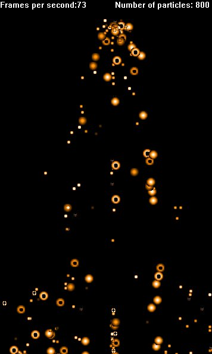

## DirectX Demonstration

### Description

This code is a Particle system using DirectX with some funky results! The Particles vairy from big blobs to rings to small balls. This code has a few comments telling you how to change a few things but nothing big. Depending on the response to this example I might make a little game called Grenade launcher! with lots of comments so keep those votes comming!!!
 
### More Info
 

             |
---                |---
**Submitted On**   |2000-08-29 20:18:16
**By**             |[Michael Pot&\#232;](https://github.com/Planet-Source-Code/PSCIndex/blob/master/ByAuthor/michael-pot-232.md)
**Level**          |Intermediate
**User Rating**    |4.5 (27 globes from 6 users)
**Compatibility**  |VB 4\.0 \(32\-bit\), VB 5\.0, VB 6\.0
**Category**       |[Graphics](https://github.com/Planet-Source-Code/PSCIndex/blob/master/ByCategory/graphics__1-46.md)
**World**          |[Visual Basic](https://github.com/Planet-Source-Code/PSCIndex/blob/master/ByWorld/visual-basic.md)
**Archive File**   |[CODE\_UPLOAD94058292000\.zip](https://github.com/Planet-Source-Code/michael-pot-232-directx-demonstration__1-11082/archive/master.zip)

